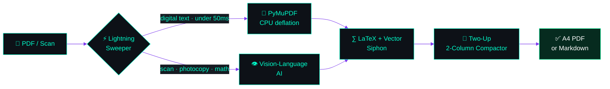
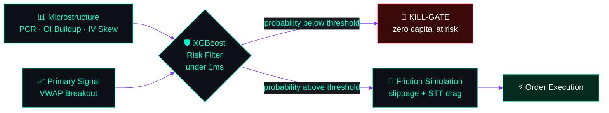
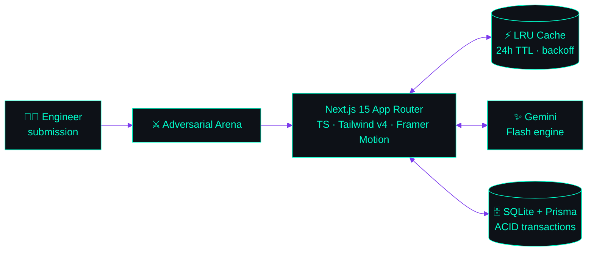
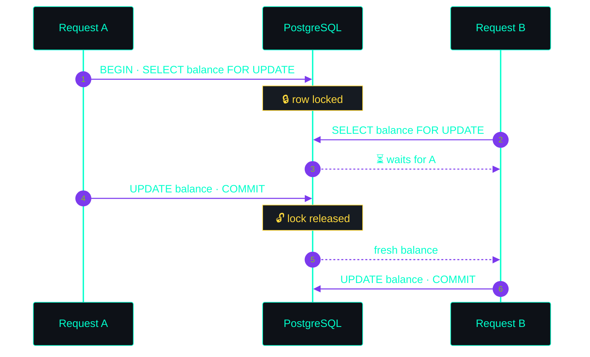

<!-- ============================================================================== -->
<!-- AARISH ALI (@Aarish1915) - PROFILE README                                      -->
<!-- Copy this whole file into your <username>/<username> repo as README.md         -->
<!-- ============================================================================== -->

<div align="center">


<br/>

<a href="https://github.com/Aarish1915"></a>
<a href="mailto:contact.aarish1915@gmail.com"></a>


</div>

<br/>

```console
aarish@localhost:~$ whoami
Aarish Ali · @Aarish1915 · backend engineer

aarish@localhost:~$ cat mission.txt
Any system works on a good day. I build for the bad ones:
race conditions, hostile input, and 3 a.m. traffic spikes.

aarish@localhost:~$ ls ./case-files
001-documorph/   002-quant-risk-copilot/   003-become-a-true-engineer/   004-hardened-backend/
```

<div align="center">


</div>


## 🧬 CASE FILE 001 // DOCUMORPH

> **Messy bilingual scans in. Publication-grade A4 out.**

<a href="https://github.com/Aarish1915/DocuMorph"></a>




<details>
<summary><b>▶ DECRYPT FILE 001</b></summary>

<br/>

| Module | What it does |
|---|---|
| ⚡ **Geometric routing** | Digital pages stay on local CPU; only hard scans hit the cloud model. API limits never blow up. |
| ∑ **Math and vector siphon** | Keeps `$$ ... $$` LaTeX intact and pulls Bezier paths via `page.get_drawings()` so circuits never clip. |
| 📐 **True compaction** | 2-column landscape typesetting (`column-count: 2`) cuts printed volume by 50% to 65%. |
| 🌍 **Translation engine** | 14+ Indian and international languages with non-destructive LaTeX shielding. |

</details>


## 📈 CASE FILE 002 // AI QUANT RISK COPILOT

> **It doesn't predict price. It decides whether a trade deserves to exist.**




<details>
<summary><b>▶ DECRYPT FILE 002</b></summary>

<br/>

- **Forward-looking features only:** Options PCR, Futures OI buildup, IV skew. No lagging indicators.
- **Walk-forward validation:** a model below the AUC floor is permanently blocked from trading.
- **No backtest illusions:** every result is charged slippage and exchange fees before it counts.

</details>


## 🎯 CASE FILE 003 // BECOME A TRUE ENGINEER

> **An adversarial arena where your code, architecture, and trade-offs get cross-examined.**




<details>
<summary><b>▶ DECRYPT FILE 003</b></summary>

<br/>

| Mode | Purpose |
|---|---|
| 💻 **Live Coding** | Write it under pressure, get reviewed like a PR. |
| 🏗 **System Architecture** | Design it, then defend the trade-offs. |
| 🎤 **Staff Mock Interview** | Bar-raiser style follow-ups. |
| 📝 **Diagnostic Exams** | Graded by a senior-reviewer persona. |

**Hardening:** `X-Frame-Options: DENY` · `X-Content-Type-Options: nosniff` · HSTS · PII leakage defense · client credential isolation.

</details>


## 🛡️ CASE FILE 004 // HARDENED BACKEND

> **Two requests. One balance. Zero lost money.**




<table>
  <tr>
    <td width="50%" valign="top" align="center">
      <h3>🎥 VidTube</h3>
      <a href="https://github.com/Aarish1915/youtube-backend"></a>
      <br/><br/>
      <sub>Node.js · Express · MongoDB aggregation pipelines · Cloudinary media · JWT auth</sub>
    </td>
    <td width="50%" valign="top" align="center">
      <h3>🔐 Defense in depth</h3>
      
      <br/><br/>
      <sub>Deduplicated state transitions via unique idempotency keys in Redis + PostgreSQL</sub>
    </td>
  </tr>
</table>


## 🧰 ARSENAL

<div align="center">

<sub><b>BUILD</b></sub><br/>

<br/><br/>
<sub><b>DATA</b></sub><br/>

<br/><br/>
<sub><b>SHIP</b></sub><br/>

<br/><br/>
<sub><b>AI AND DOCUMENT TOOLING</b></sub><br/>


</div>

<br/>

<div align="center">

## 📡 OPEN CHANNEL

<a href="mailto:contact.aarish1915@gmail.com"></a>
<a href="https://github.com/Aarish1915"></a>

<br/>

<i>"Ship it hardened."</i>


</div>
