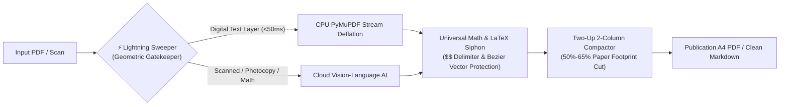
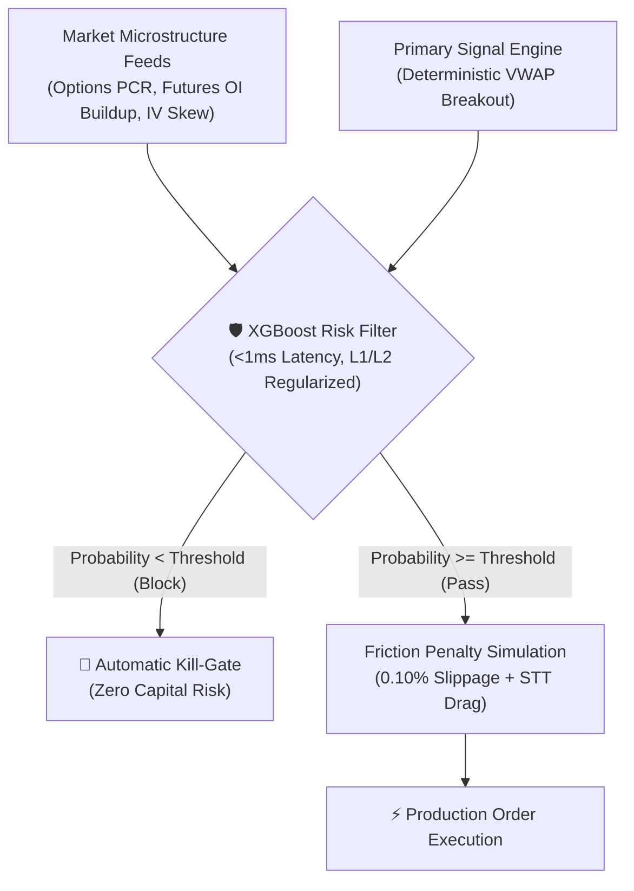
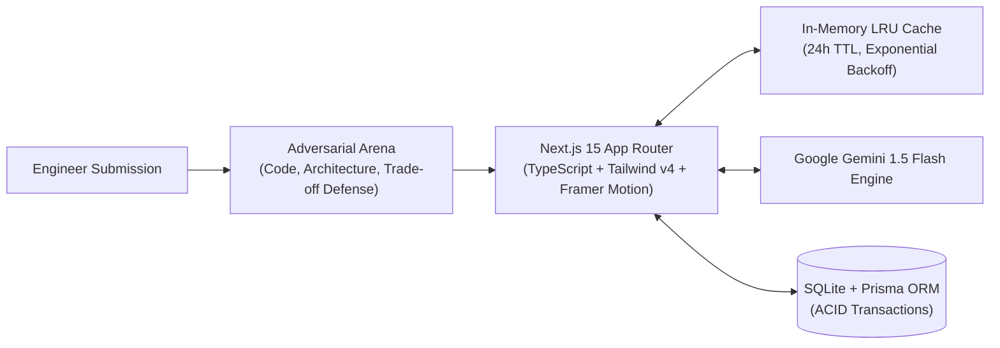

<!-- ============================================================================== -->
<!-- AARISH ALI (@Aarish1915) - FLAGSHIP SYSTEMS & ARCHITECTURE README              -->
<!-- PURE VISUAL MARKDOWN (NO CODE FENCES - COPY/PASTE DIRECTLY INTO GITHUB)        -->
<!-- ============================================================================== -->

  <!-- CYBERPUNK GRADIENT WAVING BANNER -->
  

  <!-- DYNAMIC HIGH-TECH TYPING SVG -->
  

  

    <b>Systems & Distributed Backend Architect</b> specializing in high-throughput document transformation pipelines, microsecond-latency quantitative risk filters, and hardened ACID database architectures.
  

  <!-- DIRECT ACTION & SECURITY BADGES -->
  

    
    
    
    
  

---

### ⚡ Live System Telemetry & Engineering Velocity

  <!-- WORKING STREAK & VELOCITY CARD -->
  

   
  
  
  
  

---

### 🧬 Core System 1: DocuMorph (Dual-Engine Vision & Typesetting Architecture)

> **Repository:** [`Aarish1915/DocuMorph`](https://github.com/Aarish1915/DocuMorph) • **Status:** `Production Ready (Phase 35 Verified)`

An enterprise-grade document transformation and typesetting platform built to process complex, dual-language (Hindi + English) technical documents, photocopy scans, and mathematical slide decks into publication-grade A4 PDFs on zero-budget infrastructure.

#### Key Engineering Invariants:
- **Dual-Engine Geometric Routing**: Digital pages parse on local CPU in milliseconds; complex scans route to Vision-Language models without blowing API limits.
- **Universal Math & Vector Siphon**: Preserves inline and display LaTeX delimiters (`$$ ... $$`) while extracting Bezier vector paths (`page.get_drawings()`) so complex diagrams and circuits remain unclipped.
- **True Space Compaction**: Automated 2-column landscape typesetting (`column-count: 2; column-gap: 14mm`) slashing printed volume by **50%–65%**.
- **14+ Multilingual Translation Engine**: Neural translation across Indian & international languages with non-destructive LaTeX shielding.

---

### 📈 Core System 2: AI Quantitative Risk Copilot (Meta-Labeling & Friction Engine)

> **Domain:** `Quantitative Market Microstructure & Algorithmic Execution`

A deterministic quantitative trading architecture designed around the **Meta-Labeling** paradigm, strictly rejecting speculative lagging indicators in favor of forward-looking capital-commitment data.

#### Key Engineering Invariants:
- **Meta-Labeling Risk Filter**: Rather than predicting price direction, a regularized **XGBoost** model acts as an algorithmic risk filter predicting the binary probability of primary signal success.
- **Forward-Looking Microstructure Features**: Ingests Options Put-Call Ratio (PCR), Futures Open Interest (OI) buildup, and Implied Volatility (IV) Skew.
- **Empirical Walk-Forward Validation**: Strict kill-gates enforce minimum AUC thresholds (AUC < 0.55 permanently blocked).
- **Mandatory Friction Modeling**: Zero backtesting illusions; all evaluations simulate dynamic 0.10%+ slippage and exchange fees.

---

### 🎯 Core System 3: Become A True Engineer (`Backend_enginner`)

> **Platform:** `Tier-1 (Google, Uber, Razorpay) Distributed Systems Mastery Platform`

An autonomous engineering diagnostic arena designed for high-concurrency systems design, first-principles computer science, and adversarial bar-raiser mock interviews.

#### Key Engineering Invariants:
- **OWASP-Hardened Next.js 15 Engine**: Configured with strict HTTP headers (`X-Frame-Options: DENY`, `X-Content-Type-Options: nosniff`, HSTS, and PII leakage defense).
- **Resilient AI Pipeline**: Dynamic Google Gemini 1.5 Flash integration with in-memory LRU caching, rate-limit shielding, and client credential isolation.
- **4 Diagnostic Modes**: Live Coding, System Architecture, Staff Mock Interview, and Diagnostic Exams with Senior Reviewer grading.

---

### 🛡️ Core System 4: Hardened Backend & Media Pipelines

<table>
  <tr>
    <td width="50%" valign="top">
      <h3 align="center">🔒 Concurrency & Security Engine</h3>
      <ul>
        <li><b>ACID Row-Level Locks</b>: Eliminates race conditions in balances and inventory via PostgreSQL <code>SELECT ... FOR UPDATE</code>.</li>
        <li><b>OWASP ZAP Authenticated Defense</b>: Deep automated vulnerability scanning eliminating IDOR, BOLA, and mutation XSS vulnerabilities.</li>
        <li><b>Idempotent Webhooks</b>: Deduplicated state transitions via unique idempotency keys in Redis and PostgreSQL.</li>
      </ul>
    </td>
    <td width="50%" valign="top">
      <h3 align="center">🎥 Distributed Video Backend</h3>
      

        
      

      <ul>
        <li><b>High-Throughput Node.js & Express</b>: RESTful microservice built with optimized MongoDB aggregation pipelines.</li>
        <li><b>Media Pipelines</b>: Automated video upload and transformation pipelines via Cloudinary and distributed JWT authentication.</li>
      </ul>
    </td>
  </tr>
</table>

---

### 🛠️ Weaponized Technical Matrix

#### Systems, AI & Core Languages

#### Distributed Architecture & Data Stores

#### High-Performance Frontend & Hardening

---

<!-- CYBER FOOTER BANNER -->

  

